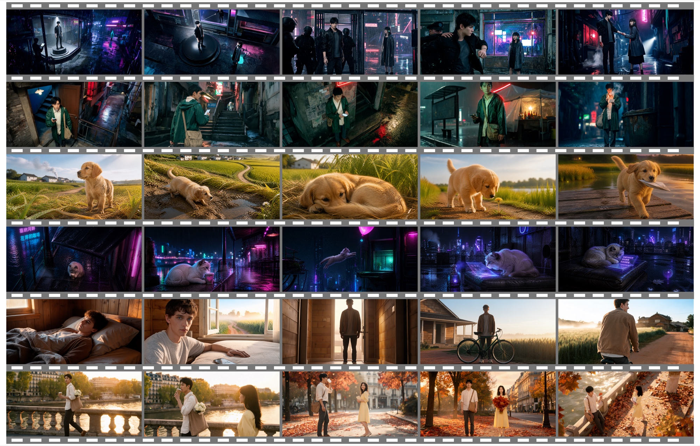
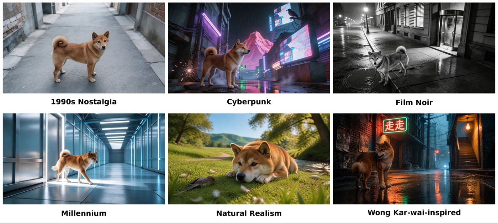
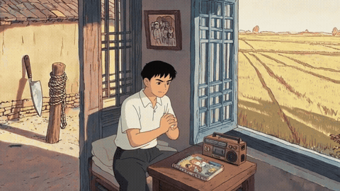
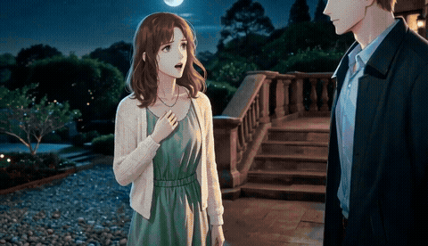
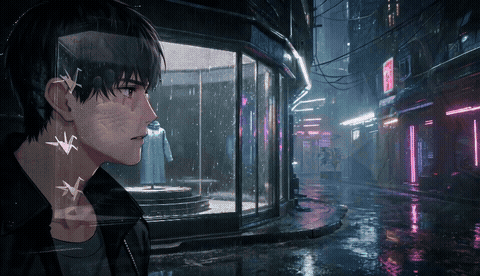
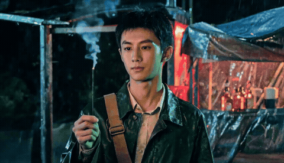

<div align="center">

# Song2StoryMV

### From Lyrics to Long-Horizon Stories for Music Video Generation

**Han Xue<sup>*</sup> · Yuanyang Chen**  
School of Information and Intelligent Science, Donghua University

<sup>*</sup>Corresponding author

</div>

## Overview

**Song2StoryMV** is a training-free multi-agent framework for generating narrative-driven, full-length music videos from synchronized lyrics and audio. Instead of translating each lyric segment into an isolated video prompt, Song2StoryMV first constructs and refines a global five-act story, then progressively turns that story into visual beats, camera-aware shots, and executable generation prompts.

The framework is designed around three goals:

- **Long-horizon narrative coherence:** organize the entire song into a causal five-act story—Setup, Rising, Conflict, Climax, and Release.
- **Cinematic and consistent visual planning:** vary framing, shot scale, camera movement, composition, and subject placement while preserving character and scene continuity.
- **Efficient narrative refinement:** use a Critic Agent to identify and revise weak parts of the story before expensive video rendering.

## Method

Song2StoryMV decomposes music-video production into three stages:

1. **Critic-Guided Narrative Planning**
   - A Narrative Planning Agent creates a five-act Narrative Arc from synchronized lyrics and audio.
   - A Narrative Critic evaluates causal coherence, lyric–narrative alignment, and world construction.
   - Targeted revisions are performed in a bounded loop of at most three attempts.

2. **Hierarchical Visual Planning**
   - A Story Spine Agent grounds the refined narrative in visible actions and persistent story states.
   - A Visual Beat Agent aligns narrative events with the song timeline.
   - A Shot Planning Agent converts each beat into one or more camera-aware shots.

3. **Consistency-Aware Prompt Generation and Rendering**
   - A Prompt Generation Agent converts the shot plan into executable prompts.
   - Character, scene, first-frame, and last-frame references are propagated across shots to improve visual continuity.

```text
Lyrics + Audio
      ↓
Narrative Planning ↔ Narrative Critic
      ↓
Refined Five-Act Narrative
      ↓
Story Spine → Visual Beats → Camera-Aware Shots
      ↓
Generation Prompts → Rendered Music Video
```

## Qualitative Results

Song2StoryMV supports diverse protagonists and visual settings while maintaining temporally coherent story development across consecutive shots.



It also supports substantial changes in palette, lighting, environment, and cinematic treatment while preserving protagonist identity and the underlying narrative setting.



## Selected Full-Song Experiments

The following storyboards are sampled at evenly spaced intervals from completed full-song generations in the experiment suite. They show how the narrative, environment, and character state evolve over several minutes rather than within a single isolated clip.

### “Daoxiang” — 1990s nostalgic rural story



Chinese song · 3:44 · 21 shots. The sequence moves from departure and memory to rediscovery of home, using a consistent young protagonist and recurring rural locations.

### “Love Story” — naturalistic romantic narrative



English song · 3:57 · 43 shots. The story follows two fictional protagonists through meeting, separation, waiting, and reunion across a shared countryside setting.

### “Model” — live-action cyberpunk narrative



Chinese song · 5:06 · 27 shots. Neon glass, rain, industrial alleys, and recurring paper-crane imagery support a story about escaping a city that controls identity and emotion.

### “Zouzou” — rain-soaked nostalgic urban narrative



Chinese song · 5:04 · 46 shots. A persistent protagonist, green raincoat, canvas bag, and handwritten map connect a long-form journey from regret toward acceptance.

## Experimental Results

We evaluate Song2StoryMV on **30 full-length songs**, including 15 Chinese and 15 English songs. The collection covers narrative storytelling, repeated refrains, metaphorical expressions, relationship-centered themes, and emotionally driven passages, with both human and animal protagonists.

The baseline comparison uses an 8-song subset containing five Chinese and three English songs. Human evaluation is conducted by ten annotators using a five-point Likert scale.

### Quantitative comparison

| Method | M-CLIP ↑ | ImageBind ↑ | LHIR ↑ | VQ4 ↑ |
|:--|--:|--:|--:|--:|
| MuseV | 0.171 | 0.210 | 0.147 | **0.853** |
| AutoMV | 0.414 | 0.324 | 0.257 | 0.814 |
| **Song2StoryMV** | **0.416** | **0.339** | **0.458** | 0.838 |

Song2StoryMV achieves the strongest lyric–visual alignment, audio–visual correspondence, and long-horizon identity retention among the compared methods. Its LHIR score improves from 0.257 for AutoMV to **0.458**.

### Human evaluation

| Method | NC ↑ | LVA ↑ | CR ↑ | VC ↑ | OS ↑ |
|:--|--:|--:|--:|--:|--:|
| MuseV | 2.83 | 3.26 | 3.18 | 3.12 | 3.06 |
| AutoMV | 3.52 | 3.76 | 3.61 | 3.70 | 3.64 |
| **Song2StoryMV** | **4.13** | **3.98** | **4.08** | **4.02** | **4.08** |

Song2StoryMV obtains the highest human-evaluation score in all five dimensions: Narrative Coherence (NC), Lyric–Visual Alignment (LVA), Cinematic Richness (CR), Visual Consistency (VC), and Overall Score (OS).

### Critic-guided refinement ablation

| Setting | Overall score | Change |
|:--|--:|--:|
| Initial narrative | 81.67 | – |
| Regeneration without Critic feedback | 82.14 | +0.48 |
| **Critic-guided refinement** | **84.89** | **+3.22** |

Structured Critic feedback improves the overall narrative score by 3.22 points, compared with only 0.48 points from unguided regeneration. It also avoids the degradation in lyric–narrative alignment and world construction observed in the no-feedback branch.

## Repository Status

This repository currently hosts the project overview, qualitative examples, and experimental results. Source code, service configuration, credentials, and raw experiment files are intentionally not included in this release.

## Citation

If you find this project useful, please cite:

```bibtex
@misc{xue2026song2storymv,
  title  = {Song2StoryMV: From Lyrics to Long-Horizon Stories for Music Video Generation},
  author = {Xue, Han and Chen, Yuanyang},
  year   = {2026}
}
```

## Acknowledgements

This repository builds on advances in large language models, image generation, and video generation. We thank the authors and maintainers of the open-source projects and evaluation tools used in this work.
